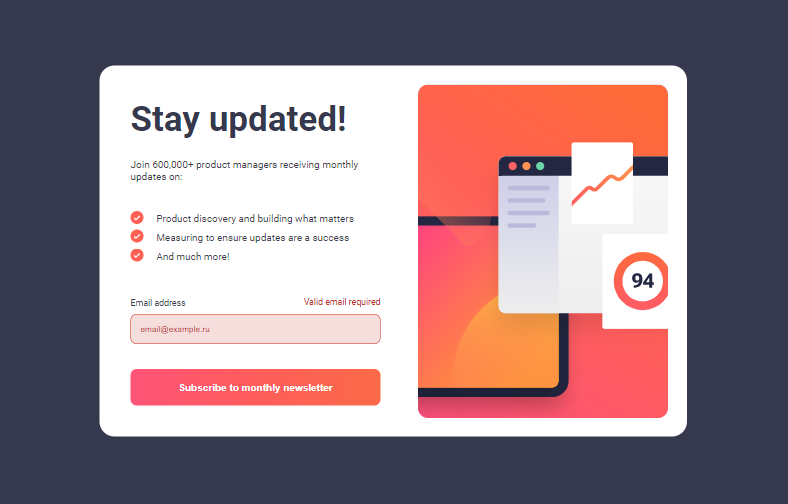

# Frontend Mentor - Newsletter sign-up form with success message solution

This is a solution to
the [Newsletter sign-up form with success message challenge on Frontend Mentor](https://www.frontendmentor.io/challenges/newsletter-signup-form-with-success-message-3FC1AZbNrv).
Frontend Mentor challenges help you improve your coding skills by building realistic projects.

## Table of contents

- [The challenge](#the-challenge)
- [Screenshot](#screenshot)
- [Link](#link)
- [Author](#author)

### The challenge

Users should be able to:

- Add their email and submit the form
- See a success message with their email after successfully submitting the form
- See form validation messages if:
    - The field is left empty
    - The email address is not formatted correctly
- View the optimal layout for the interface depending on their device's screen size
- See hover and focus states for all interactive elements on the page

### Screenshot

### Link

- Live Site URL: [Tap here](https://mister-mandarin.github.io/newsletter-sign-up)

## Author

- GitHub - [@mister-Mandarin](https://github.com/mister-Mandarin)
- Frontend Mentor - [@mister-Mandarin](https://www.frontendmentor.io/profile/mister-Mandarin)
- VK - [@Andrey](https://vk.com/andrei_poluektov)
- Instagram - [@Mandarin](https://www.instagram.com/andrey_poluehktov/)